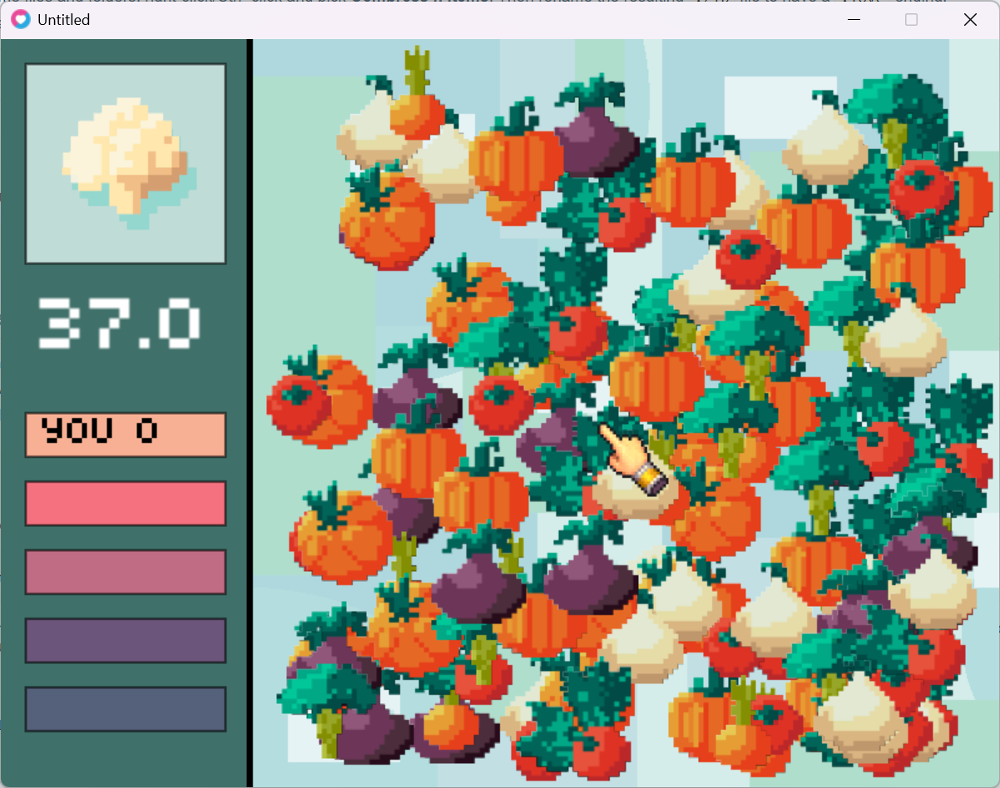
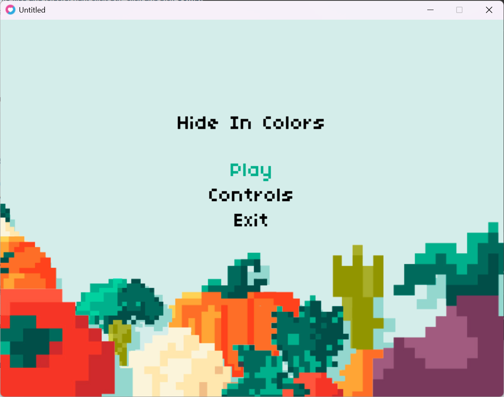
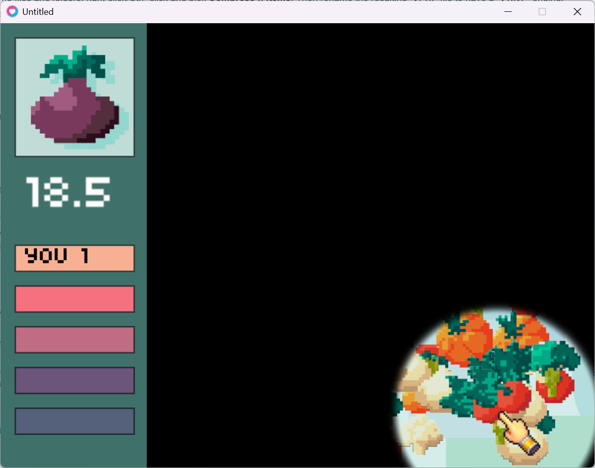
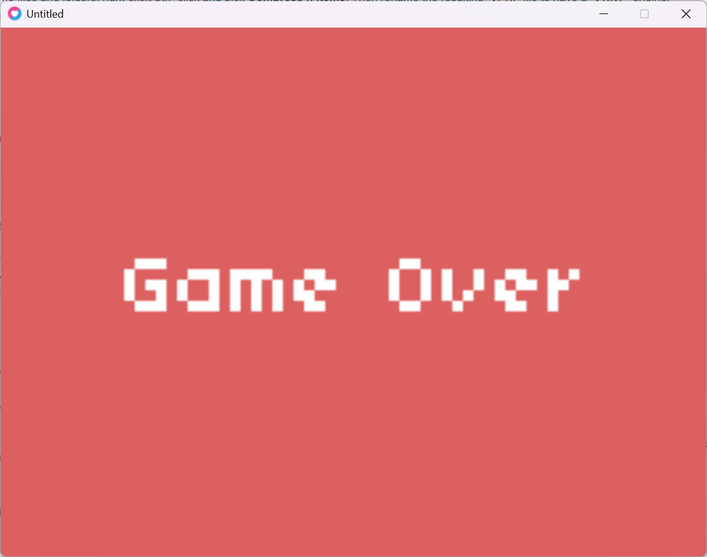

# Hide In Colors

### Description

Small game made for a class game jam with the Love2D game engine

### Features

 - Find the right fruit
 - Don't let the time run out
 - Two different game modes
 - Scoreboard

### Controls

Keyboard:
 - Up, Down, Left, Right arrows: select on Main Menu
 - Left click: select fruit
 - Escape: pause game, leave Game Over screen

### Screenshots

Wait... these aren't even fruits...

### License

This work is licensed under CC BY-NC-ND 4.0. To view a copy of this license, visit https://creativecommons.org/licenses/by-nc-nd/4.0/
